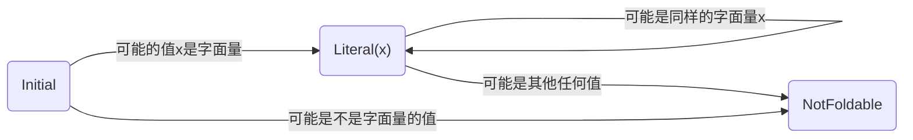
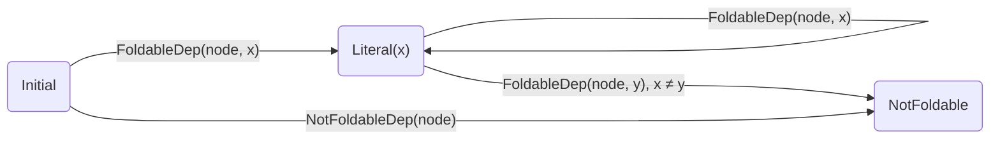

# Tree Shaker 报告

_Kerman 2025/3/24

---

# 重新介绍 Tree Shaker

<div text-4xl text-center p-4 pt-20>

语义层面的 JS 代码体积优化器

</div>

<div text-2xl text-center p-4>

基本分析框架 + Tree shaking / Constant folding / Mangling ... 

</div>

---

# Demo - Constant Folding

<table><tbody><tr><td width="500px"> Input </td><td width="500px"> Output </td></tr><tr>
<td valign="top">

```js
export function f() {
  function g(a) {
    if (a) console.log("effect");
    else return "str";
  }
  let { ["x"]: y = 1 } = { x: g("") ? undefined : g(1) };
  return y;
}
```

</td><td valign="top">

```js
export function f() {
  return 1;
}
```

</td></tr></tbody></table>

---

# Demo - Remove Dead Code

<table><tbody><tr><td width="500px"> Input </td><td width="500px"> Output </td></tr><tr>
<td valign="top">

```js
function f(value) {
  if (value) console.log(`${value} is truthy`);
}
f(1);
f(0);

function g(t1, t2) {
  if (t1 && t2) console.log(2);
  else if (t1 || t2) console.log(1);
  else console.log(0);
}
g(true, true);
g(false, false);
```

</td><td valign="top">

```js
function f() {
  {
    console.log("1 is truthy");
  }
}
f();

function g(t1) {
  if (t1 && true) console.log(2);
  else {
    console.log(0);
  }
}
g(true);
g(false);
```

</td></tr></tbody></table>

---

# Demo - Object Property Mangling

<table><tbody><tr><td width="500px"> Input </td><td width="500px"> Output </td></tr><tr>
<td valign="top">

```js
export function main() {
  const obj = {
    foo: v1,
    [t1 ? "bar" : "baz"]: v2,
  };
  const key = t2 ? "foo" : "bar";
  console.log(obj[key]);
}
```

</td><td valign="top">

```js
export function main() {
  const obj = {
    a: v1,
    [t1 ? "b" : "c"]: v2,
  };
  const key = t2 ? "a" : "b";
  console.log(obj[key]);
}
```

</td></tr></tbody></table>

---

# Demo - Class Tree Shaking

<table><tbody><tr><td width="500px"> Input </td><td width="500px"> Output </td></tr><tr>
<td valign="top">

```js
class A {
  method(x) {
    console.log("A", x);
  }
  static static_prop = unknown;
}
class B extends A {
  method(x) {
    console.log("B", x);
  }
  unused() {
    console.log("unused");
  }
}
new B().method(A.static_prop);
```

</td><td valign="top">

```js
class A {
  static a = unknown;
}
class B extends A {
  a(x) {
    console.log("B", x);
  }
}
new B().a(A.a);
```

</td></tr></tbody></table>

---

# Demo - JSX

> `createElement` also works, if it is directly imported from `react`.

<table><tbody><tr><td width="500px"> Input </td><td width="500px"> Output </td></tr><tr>
<td valign="top">

```jsx
function Name({ name, info }) {
  return (
    <span>
      {name}
      {info && <sub> Lots of things never rendered </sub>}
    </span>
  );
}
export function Main() {
  return <Name name={"world"} />;
}
```

</td><td valign="top">

```jsx
function Name() {
  return (
    <span>
      {"world"}
      {}
    </span>
  );
}
export function Main() {
  return <Name />;
}
```

</td></tr></tbody></table>

---

# Demo - React.js

> We also have special handling for some React.js APIs. For example, React Context, `memo`, `forwardRef`, `useMemo`, etc.

<table><tbody><tr><td width="500px"> Input </td><td width="500px"> Output </td></tr><tr>
<td valign="top">

```jsx
import React from "react";
const MyContext = React.createContext("default");
function Inner() {
  const value = React.useContext(MyContext);
  return <div>{value}</div>;
}
export function main() {
  return (
    <MyContext.Provider value="hello">
      <Inner />
    </MyContext.Provider>
  );
}
```

</td><td valign="top">

```jsx
import React from "react";
const MyContext = React.createContext();
function Inner() {
  return <div>{"hello"}</div>;
}
export function main() {
  return (
    <MyContext.Provider>
      <Inner />
    </MyContext.Provider>
  );
}
```

</td></tr></tbody></table>
---

# 目录

<div />

<div text-xl>

1. 基本分析框架

    1.1. 值和依赖

    1.2. 穷举块和穷举依赖

    1.3. 递归的处理
 
2. Tree Shaking
3. Constant Folding
4. Object Property Mangling
5. 效果测试
6. 下一步计划

</div>


---

# 1. 基本分析框架

### 理论来源

tree-shaking 的 “先假定所有代码无用，通过分析来褪优化其中有用的部分”<br>
[*Tree-shaking versus dead code elimination* by Rich Harris, 2015](https://medium.com/@Rich_Harris/tree-shaking-versus-dead-code-elimination-d3765df85c80)

> 对比 DCE: 先假定所有代码不能优化，通过规则判断哪些代码可以优化掉

<div h-6 />

### 两个步骤

<div h-3 />

1. 通过模拟执行代码的方式，收集信息。（符号执行）
2. 基于收集的信息来 transform AST，实现代码体积的优化。

第一步逻辑上非常直观，可以说是“以叠加态的方式来执行代码”，但是实现起来要考虑许多问题。

---

# 1.1 值和依赖

<div />

在分析时，用 Entity 表示一个表达式或变量是什么。

$$
\text{Entity} = \text{Value} \times \text{Dep}
$$

1. **值**（Value）：一个 Lattice。比如数字或对象或未知值等等。

2. **依赖**（Dep）：一个树状结构，表示需要保留哪些节点/进行哪些褪优化，才能得到这个值。

    具体可以是：

    - AST 节点
    - 另外一个 Entity
    - 条件分支相关：`BranchingDep`
    - Constant folding 相关：`FoldableDep`, `NotFoldableDep`
    - Mangling 相关：`NoMangle`, `Equal`, `Unequal`
    - ...

---

# 1.1 值和依赖

一个例子（不考虑常量折叠）

```js
const a = 1;
const b = 2;
const c = a + b;
```

分析后，`a`, `b`, `c` 的值分别是 `1`, `2`, `3`，依赖分别是:

- `a`: AST 节点 BindingIdentifier(`a`)
- `b`: AST 节点 BindingIdentifier(`b`)
- `c`: AST 节点 BindingIdentifier(`c`)，和 `a`, `b` 对应的 Entity。

当某个 Entity 被消耗时，意味着它的值失去追踪，依赖被消耗。

作为原始值的 number 失去追踪没有意义，而 object 失去追踪意味着它们的属性变得完全未知。

---

# 1.1 值和依赖

另一个例子

```js
const now = Date.now();
//          ^~~~~~~~~~ A
const str = base64(now);
//          ^~~~~~~~~~~ B
globalThis.x = str;
```

在这个例子中，模拟执行完第一行后，`now` 的值是 `UnknownNumber`，依赖是 `A`。

模拟执行第二行后，`str` 的值是 `UnknownString`，依赖是 `{ A, B }`。

第三行中，由于无法追踪 `globalThis` 的值，所以 `x` 的值和依赖被“消耗”掉了，这意味着节点 `A` 和 `B` 都需要被保留。

---

# 1.2 穷举块和穷举依赖

<div />

以上的两个例子都是简单的顺序分析，但是并非所有的代码都可以这样，比如：

- 循环和递归调用：理论上已经证明了静态分析不可能精确地分析它们。
- 生成器 / 异步函数：涉及执行的时机问题，分析起来极其复杂。
- 无法追踪调用时机的函数：比如传入 `setTimeout` 的回调函数。

此时，我们需要穷举所有可能的执行路径，来保证优化的正确性。

> 这个事情的术语是什么？悲观分析？

---

# 1.2 穷举块和穷举依赖

循环的例子

```js
let x = 0;
while(calc(x)) {
  x++;
}
// ...
```

分析的最好结果只能是 `x` 为未知数字，但不可能确定 `x` 的值。

`while` 语句就是一个穷举块。第一次执行循环时，它首先读取了 `x`（其值是 `0`），因此 `x` 是它的依赖；然后它修改了 `x` 的值，因此此前 `x` 的值发生了变化，假设无效，需要放宽 `x` 到 `UnknownNumber`，并再次分析循环体。

- 读取变量/对象成员：若非已穷举的值，则记录为依赖
- 写入变量/对象成员：若非已穷举的值，则将其值设置为未知值，且若它是一个依赖就需要重新分析循环体。
- 执行完循环体后，不会记录这些依赖

---

# 1.2 穷举块和穷举依赖

无法追踪调用时机的函数的例子

```js
let x = 0;
setInterval(() => console.log(x), 1000);
// ...
x = 1;
```

在这个例子中，`setInterval` 的回调函数无法追踪调用时机，因此它是一个穷举块。

在执行 `x = 1` 时，该回调函数需要重新分析，因为 `x` 的值可能影响其执行，且 `x` 的新值需要正确地被消耗。

因此和循环不同的是，需要记录 `x` 为穷举的依赖。当后续代码中 `x` 被写入时，就需要重新分析这个穷举块。

---

# 1.2 穷举块和穷举依赖

<div />

- 循环穷举：每当自己写入了自己先前的依赖，就重新分析
- 注册依赖：自己执行完后，对它的依赖的写入也需要触发重新分析

| 类型 | 循环穷举 | 注册依赖 |
| ---- | ---- | ---- |
| 循环 | Yes | No |
| 递归   | Yes | Yes |
| 生成器 / 异步函数 | No | Yes |
| 无法追踪调用时机的函数 | Yes | Yes |

---

# 1.1 递归的处理

<div />

有的时候递归函数可以顺序分析，有时候只能穷举。

```js
function wrapper(f) {
  return function wrapped(...args) {
    return f(...args.reverse());
  };
}
const f1 = wrapper((a, b) => a / b);
const f2 = wrapper((a, b) => f1(a, b));
f2(1, 2);
```

在上例中，表面上看 `wrapped` 函数调用了自身，但其实是对应同个节点的两个不同闭包之间的调用，仍然是可以顺序分析的。

因此判断递归的标准不是函数对应的节点，而是是否是同一个闭包。

---

# 1.3. 递归的处理

<div />

只考虑上述规则，会造成分析过程的死循环：

```js
function f(a) {
  return () => unknownCondition() && g(a + 1)
}
function g(b) {
  return () => unknownCondition() && f(b + 1)
}
```

此处不断有新的闭包被创建，导致分析无穷无尽。

因此判断递归的标准有两条：

1. 同个闭包实例调用自身
2. 在闭包内创建了自己的另外一个闭包实例

当函数调用被判断为递归时，就当作穷举块来处理（见上文）。

---

# 2. Tree Shaking

<div />

基于以上的分析框架，我们就可以实现单 pass，理论可达最优的 Tree Shaking。

1. 在分析阶段，为值附加上一些节点作为依赖
2. 如果这些依赖被消耗掉了，就意味着对应的节点需要被保留
3. 在 transform 阶段，删除掉没有被标记为需要保留的节点

```js
const a = ...;
// ...
```

`a` 的值依赖于 `BindingIdentifier(a)`。假设 `a` 被消耗，那么 `BindingIdentifier(a)` 也会被消耗掉。

Transform 阶段，就知道需要保留 `a`，并保留其初始值。

反之，整个 `a` 都会被删除掉。

---

# 2.1. 执行依赖

<div />

副作用的执行往往依赖于其本身之外的节点，包括其执行路径上的节点。

Tree-shaker 必须恰当地保留这些依赖，才能保证结果的正确性。

- 条件分支：比如以下代码中，`effect()` 的执行依赖于 `a` 的值为真值：

```js
if (a) effect();
```

- 函数调用：比如以下代码中，`effect()` 的执行依赖于 `f()` 的执行：

```js
function f() {
  effect();
}
f();
```

- 其他，比如以下代码中，`effect1()` 和 `effect2()` 的执行依赖于 `obj != null`：

```js
const obj = { x: 1 }(({ [effect1()]: _unused } = obj));
obj[effect2()] = 2;
```

> 赋值到外层变量也会附加上这些依赖。

---

# 2.2. 条件语句的处理

<div />

从模拟执行的角度来讲，条件语句非常简单：

- 如果能确定条件的真假，就执行对应的分支
- 如果不能，就以不确定的方式执行所有分支

但从 Tree Shaking 的角度来讲，由于要做到正确且最小，因此需要特别的处理。

Tree Shaker 需要知道条件语句的如下信息：

- 是否可能进入某个分支。比如 `if (false) { f() }` 可以删去
- 分支是否有副作用。比如 `if (a) { pure() }` 可以删去
- 是否需要测试值。比如 `if (true) { f() }` 可以变为 `{ f() }`

---

# 2.2. 条件语句的处理

<div />

一个分支有没有副作用，只有在整个分析完全结束之后才能确定。比如：

```js
const t = pure();
let a = 1;
if (t) {
  a = 2; // 其实没有副作用
}
a = 3;
globalThis.x = a;
```

事实上，这里的 if 语句可以整个删除，因此 `t` 也可以整个删除。而在分析到 if 语句的当下，`t` 的值似乎发生了作用，但从全局来看并没有。

因此，我们也不可能在执行条件分支语句的当下就确定上述的任何性质。唯一的方式是把会影响条件分支优化的信息放在依赖里。这样只有某一次执行存在效果时，其对优化的影响才会被考虑。

具体的实现方式不再赘述。

---

# 3. Constant Folding

<div />

常量折叠是优化代码体积的常见手段。对于 tree-shaker 来说，整个分析本身就需要对每个节点的在运行时可能出现的值进行分析，因此常量折叠更像是一个顺便实现的东西。tree-shaker 的常量折叠比其他 js 优化器更加彻底。

一种传统的常量折叠方法是反复地寻找操作数都是字面量的计算，然后将其计算结果替换掉原来的表达式，直至没有更多的字面量可以折叠为止。

这种方法的缺点：

1. 每次折叠都需要一次 AST 的遍历，效率较低
2. 并且在涉及函数调用传参时需要制定特别的规则来处理。而这些规则无法覆盖非常复杂的情况，比如动态的函数调用。因此无法实现最完整的常量折叠。
3. 其他优化，如死代码消除和常量折叠之间会相互作用，他们往往需要轮流调用。

---

# 3. 何时可以折叠

<div/>

当一个节点在运行时只可能出现一种字面量值，就可以将其折叠为字面量值。

而此处的“运行时”是指优化后的运行时，需要考虑死代码消除的影响。比如：

```js
function f(value) {
  return pureCalc(value);
}
const a = f(1), b = f(2);
x = a;
```

只有在 `b` 作为无用代码被删除后，`f` 里的 `value` 才能折叠。比较理想的结果是：

```js
function f() {
  return pureCalc(1);
}
const a = f();
x = a;
```

> 这个问题在之前没有被考虑。后来进行了重写，修复了这一问题。

---

# 3. 副作用的处理

<div/>

此外，计算结果为可折叠的字面量的表达式自身可能带有副作用。对此，有两种解决方案：

1. 若有副作用就不执行常量折叠
2. 执行常量折叠，但将副作用提取出来，放在一个 `SequenceExpression` 中。如 `(side_effect, collect_literal)`。

目前采用了第二种方案。因为第一种方案会导致 Tree-shaker 的常量折叠极为复杂，而这种情况本身就极少见。

---

# 3.1. 节点状态

通过一个简单的状态机来表示一个节点是否可以被折叠：



当分析完成后，如果一个节点的状态是 `Literal(x)`，那么它就可以被折叠为 `x`。否则，它就不能被折叠。

---

# 3.2. 依赖

每当值流经一个节点，如果这个情况最终被保留（没有被删除），这个值就会影响这个节点是否可以被折叠。这恰恰契合 tree-shaker 中值的依赖的概念。

- 如果值 `value` 是可以表示为字面量，则加带 `FoldableDep(node, value)` 的依赖
- 如果值 `value` 是不可以表示为字面量，则加带 `NotFoldableDep(node)` 的依赖

当这些依赖被消耗时，就会更新 `node` 的状态。上文的状态机相对于依赖的消耗可以表示为：



---

# 3.3. 计算过程的删除

被折叠的节点，我们希望删除其计算过程需要的节点。比如：

```js
function f() {
// ~~~~~~~~~~~ A
  return   1   +   2;
// ~~~~~ B
}
x = f();
//  ^~~ C
```

优化时会删除整个 `f` 函数，得到 `x = 3`。故当节点可以被折叠时，就不应当保留它的计算过程。

比如对于 `f()` 节点，在分析时，其原本的依赖是 `{ A, B, C }`，由于它可以被折叠，因此依赖就被替换为：`{ FoldableDep(node=C, value=Entity(3, { A, B, C })) }`。

此时，当它被赋值给 `x` 时，就会消耗掉 `{ FoldableDep(...) }`，而非常规的 `{ A, B, C }`。这一操作根据上文所述，会将 `C` 节点的状态从 `Initial` 变为 `Literal(3)`；但不像之前的值那样会将 A, B, C 节点标记为需要保留。

---

# 3.4. 计算过程的保留

有些节点，在初次分析时被认为可以被折叠，但在后续的分析中又被认为不可以被折叠。比如：

```js
function f(x) {
// ^~~~~~~~~~~~ A
  console.log(    x    );
// ^~~~~~~~~~ B   ^ C
}
f(    1    );
//    ^ D
f(    2    );
//    ^ E
```

在这个例子中，`f(1)` 执行完后我们认为节点 C 可以被折叠，而在 `f(2)` 执行完后，却发现并不行。此时我们应当保留 A, D, E 节点。

这样的保留操作，是在节点转换到不可折叠的状态时完成的。此前节点会收集所有被保留的可能的原始值（即上一节所说的原始的值）。而当它转换到不可折叠的状态时，就会将这些值消耗掉，以保留它们的计算过程。

---

# 4. Object Property Mangling

<div />

各个 Minifier 已经能够完美地删除代码中的无用字符，如空格和一些分号。同时它也能重命名变量名，比如：

```js
const myVariable = { value: 42 };
log(myVariable.value * 2);
```

会被压缩为：

```js
let e={value:42};log(e.value*2)
```

但是它无法处理对象属性名的重命名，如上例中的 `value`。此类属性名由于 JS 的动态特性，很难被分析和重命名。而在压缩后的代码中，这些属性名占据可观的空间，尤其是在 gzip 之后。这是 JS 代码体积优化中重要的未解决难题。

通过一些简单的估计，如果此项优化达到完美，可以节约约 30% 的代码体积，无论对于库还是应用。（需要补充数据）

---

# 4.1. 现有方案

### Terser 等

Terser 支持对象属性名的重命名，但从设计上无法保证安全，因此很难被实际使用。比如如下情况：

```js
const obj = { foo: v1, bar: v2 };
const key = t1 ? "foo" : "bar";
log(obj.foo, obj[key]);
```

会被压缩为：

```js
const obj = { a: v1, b: v2 };
const key = t1 ? "foo" : "bar";
log(obj.a, obj[key]);
```

而后者在显然是错误的。这是由于它没有办法分析动态访问属性的情况。这是基于规则的优化器的局限性，因为规则不可能编写得无限复杂，而现实中的情况无穷无尽，为了效果好，它只能牺牲正确性。

---

# 4.1. 现有方案

### esbuild 等

它们采取了一种变通方式。它们通过允许用户手动配置优化的白名单/黑名单，比如只优化 `_` 开头的属性名等。这种方式缺少通用性，且配置起来相对麻烦，把风险留给了用户。

### VSCode 的打包器

VSCode 使用 TypeScript 编写，它在打包时通过调用 TypeScript 提供的代码重构功能来重命名属性名，实现相对安全的属性压缩。

这种方式的缺点是只能用于 TypeScript 项目，且项目中若存在跳过类型检查的行为（比如 `as any`），则会导致结果错误。且无法通过此方法压缩打包的第三方库的代码。不适合一般应用程序使用。

其[官方博客](https://code.visualstudio.com/blogs/2023/07/20/mangling-vscode)指出，这种方式减小了 14% 的体积。

---

# 4.2. 字符串字面量的重命名

同样是基于 Tree-shaker 的分析框架。

作为 Object Property Mangling 的基础，首先需要实现字符串字面量做比较的重命名，即：

```js
const s1 = "hello", s2 = unknown ? "hello" : "world";
log(s1 === s2);
```

优化为：

```js
const s1 = "a", s2 = unknown ? "a" : "b";
log(s1 === s2);
```

---

# 4.3. 不可重命名的约束

<div />

每当碰到可以折叠为字符串的常量，就为它添加一个依赖：`NoMangle(node)`，表示它无法被重命名。比如：

```js
const str = "hello";
log(str);
```

- 分析完第一行后，`str` 的值是 `"hello"`，依赖于 `NoMangle("hello")`。
- 第二行中，`log` 函数调用会褪优化作为参数的 `str`，于是 `"hello"` 节点就被标记为不可重命名了。

因此，这个优化得到的结果是 `"hello"` 无法被重命名。这是符合预期的。

---

# 4.4. 相等性的约束

<div />

当数个字符串之间只做等于和不等于比较时，它们就可以被重命名。这是通过相等性的约束来实现的。比如上文的例子：

```js
const s1 = "hello", s2 = unknown ? "hello" : "world";
//         ^ A                     ^ B       ^ C
log(s1 === s2);
```

在 `s1 === s2` 处，`s1` 的值是 `"hello"`，依赖于 `NoMangle(A)`。而 `s2` 的值是 `"hello"` 或者 `"world"`，分别依赖于 `NoMangle(B)` 和 `NoMangle(C)`。

`s1 === s2` 运算的结果是 `true` 或者 `false`，分别依赖于 `"hello" === "hello"` 和 `"hello" !== "world"` 的事实。因此，该运算的结果被分析为 `true` 依赖于 `Equal(A, B)`，`false` 依赖于 `Unequal(A, C)`。而之前的 `NoMangle(x)` 依赖会被抛弃，因为它已不再是值的依赖。

`Equal` 和 `Unequal` 约束也可以包含两个以上的节点。表示它们之间的值是相等的或两两不同。

---

# 4.5. 约束的求解

<div />

通过上述方式，在分析完成后，我们会得到一组约束，包含 `NoMangle`，`Equal` 和 `Unequal`。

通过一个不算很复杂的算法，就可以求解出各个节点满足约束的最短值是什么。

> 计算过程可以写在论文里，但我还不会写伪代码。

以上是分析阶段所做的事，在 transform 阶段，就用求解出的值来替换掉原来的值。

至此，我们就实现了字符串字面量的重命名，为对象属性的重命名铺平了道路。

---

# 4.6. 将对象属性的重命名看作字符串字面量的重命名

<div />

首先我们把静态属性访问当作动态属性访问来处理，显式表达出来，所有对象相关的语法都是字符串字面量相关的操作：

```js
({ foo: "hello", bar: "world" })
// --> { "foo": "hello", "bar": "world" }
obj.foo
// --> obj["foo"]
```

#### 属性名不能冲突

每个对象之间的属性名称不能冲突。我们使用 `Unequal` 约束来表达：

```js
const obj = { "foo": 1, "bar": 2, "baz": 3 };
//            ^A        ^B        ^C
```

此时 `obj` 里的各个值都依赖于 `Unequal(A, B, C)`。

---

# 4.7. 访问存在的属性

<div />

访问对象时，若确实存在这个属性，则返回的值依赖于 `Equal` 约束。比如：

```js
const obj = { "foo": 1, "bar": 2 };
//            ^A        ^B
const key = "foo";
//          ^C
x = obj[key]
```

在这里，`obj[key]` 的值 `1` 依赖于 `Equal(A, C)` 和 `Unequal(A, B)`，但不依赖于 `NoMangle(A)` 和 `NoMangle(C)`。

---

# 4.8. 访问不存在的属性

<div />

访问对象时，若不存在这个属性，则返回的值依赖于 `Unequal` 约束。比如：

```js
const obj = { "foo": 1, "bar": 2 };
//            ^A        ^B
const key = "baz";
//          ^C
x = obj[key]
```

在这里，`obj[key]` 的值 `undefined` 依赖于 `Unequal(A, B, C)`。

---

# 4.9. 访问动态属性

```js
const obj = { "foo": 1, "bar": 2 };
//            ^A        ^B
const key = unknown ? "foo" : "baz";
//                    ^C      ^D
x = obj[key]
```

在这里，`obj[key]` 的值可能是：

- `1`，依赖于 `Equal(A, C)` 和 `Unequal(A, B)`；
- `undefined`，依赖于 `Unequal(A, B, D)`；

求解这些约束，得出 `A` 最小可以是 `"a"`，`B` 最小可以是 `"b"`，`C` 最小可以是 `"a"`，`D` 最小可以是 `"c"`。

---

# 4.10. 无法追踪的情况

除非整个环境的原型链被污染，Tree-shaker 的优化要求绝对安全。在碰到无法追踪的情况时，优化会放弃。比如：

```js
const obj = { "foo": 1, "bar": 2 };
//            ^A        ^B
x = obj[unknown]
```

由于 `unknown` 的值是未知的，因此 `obj[unknown]` 的值是未知值，依赖于 `NoMangle(A)` 和 `NoMangle(B)`。最终生成的约束也即这两者，结果就是无法优化属性名。

---

# 4.11. Object Property Mangling 总结

<div />

## 原型链怎么处理？

通过模拟 JS 访问原型链的逻辑，生成多组 `Equal` 和 `Unequal` 约束即可。

写起来比较麻烦，但逻辑上是简单的。

## 效果

首次实现了 JavaScript 的完全安全（Soundiness）的对象属性名重命名。

## 不足

受制于整个基本的分析框架的限制，许多动态访问的属性名的值无法被精确地得出，因此无法开展对象属性名的重命名，使得实际效果大打折扣。在这个情况下，此项优化率往往只能贡献可以忽略不计的体积优化。

---

# 5. 效果测试

<div />

总体来说不达预期。

- 对于一个小 App（React + Ant-design），优化了约 15\% 的体积
- 对于一个中小型 App（React + geist-ui），优化了约 20\% 的体积 （主要优化了没有用到的图标组件）
- 对于 ZVMS（典型的 Vue + Element-plus），优化了约 3\% 的体积
- 对于十数个 library （有新有旧），优化率大多在 0.5\% 到 1\% 之间（主要优化点：删除 polyfill 和 object property mangling）
- 优化所需时间都还不错
- 还是有不少 bug

---

# 6. 下一步计划

<div />

- 我已经不再认为可以做到生产可用了

    - 工作量很大，时间精力不足

- 还可以提升的点：Property 粒度的穷举依赖

    - 这会显著提升一些库的压缩率，比如 noVNC

    - 域敏感

- 整理代码，开始写论文

    - 哪些是真正的创新点？
    - 术语的积累不够
    - 望指导

<!--

- 总结代码框架/图
- 核心的贡献点
- 理论上的抽象
- 相关工作，使用+区别

-->

---
layout: end
---

谢谢！
